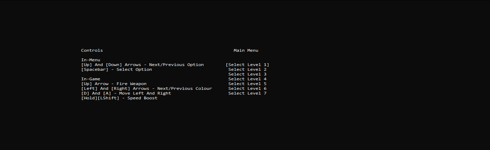
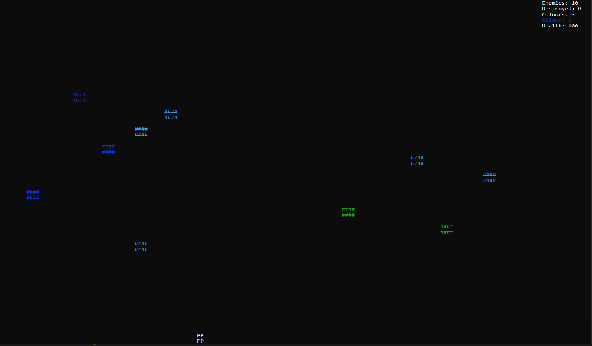
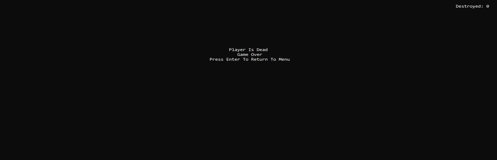
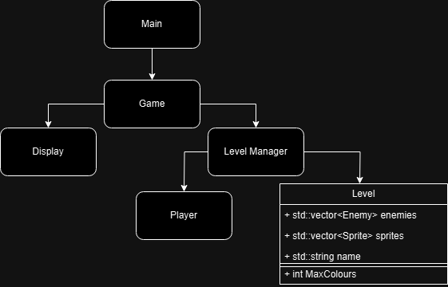

# C++ Based Console Game
# Build Instructions
Assuming you have g++ installed, simply open the build.bat file in the project directory

# Gameplay Features
The gameplay is inspired by the original space invaders, although in this case, the game creates difficulty by using the different colours displayable in the console.

Featuring:
- Multiple Levels, Progressively Get Harder By Increasing Max Colours
- Level Selection Menu, Game Win Screen And Game Lose Screen
- Projectile And Collision System
- Level Loading System
- Sprite And Object Loading And Creation System (Unused)

# Dependencies
There are only two dependencies used in this projects.
- The standard windows.h library in order to use console functions. 
- json.h used to parse the level files: found at - https://github.com/nlohmann/json
- The display class also uses a heavily modified version of the console game engine: found at - https://github.com/OneLoneCoder/Javidx9/blob/master/ConsoleGameEngine/olcConsoleGameEngine.h

# Gameplay Examples
Main Menu

\
In-Level

\
Dead

\
Won

# Development Patterns Utilised
For the project overall i opted to use composition over inheritance. \
The prototype follows the basic pattern of having a main game loop, a level manager and a display/screen.

Application Diagram \

# Level Manager
The level manager contains references to all objects in the scene through the level struct, while also keeping track of the game state, player state and enemy state. \
The level manager is also responsible for loading each level from their respective level.json file and generating the scene. \
While the level state is set to playing, the level manager will continuously spawn randomly generated enemies.

# Display
The display class contains all the functions used to display content. \
The display create function is called to create a new console window and prepare the buffer ready for data. 

# Sprites And Objects
Each object/sprite on the screen contains an update and draw function called by the level manager.

# Enemies
As a result of not using inheritance, the enemy doesn't inherit from the sprite class, instead, the enemy object contains and controls a sprite object. \
Each enemy has a colour associated with it when spawned, this colour comes from a random selection of the colours contained in level.json file selected.

# Player
The player class also contains a sprite object, similarly to the enemy class. \
The controls for the player are housed within the update function. This update function is called through the level manager loop. \
The other update function within the player class is the FixedUpdate function, this function is called only once a certain amount of time has passed, this is similar to the likes of professional game engines such as unity. \
The function is used to update the position of the player at a set interval, using a velocity (x, y) set by the controls.

# Evaluation
Overall the project went well, although time became a limiting factor towards the end, so many of the planned features had to be cut

